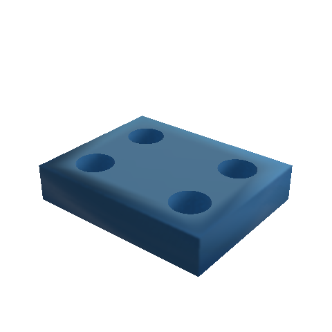
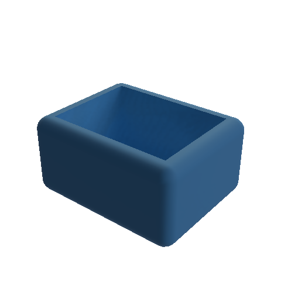
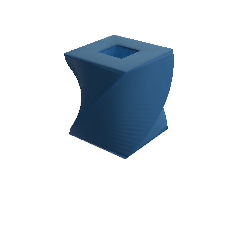
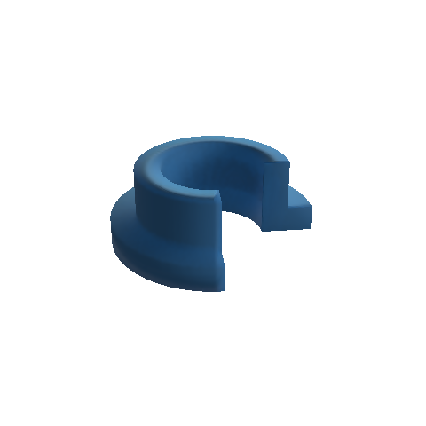
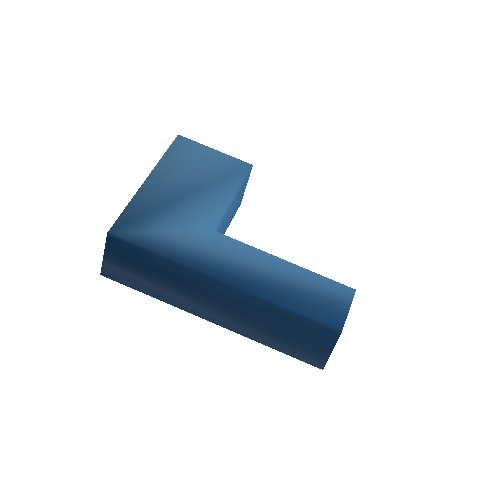

# jscad-to-manifold

Convert a serializable `jscad-planner` operation tree into a native `manifold-3d`
solid. Boolean operations and transformations execute directly in Manifold;
2D shapes become cross sections until extruded.

Manifold is **injected**, with no runtime or peer dependency on `manifold-3d`.
The application chooses its version and controls WASM loading and initialization.
The package uses Manifold only as a development dependency for integration tests.

Install from the repository (builds automatically on installation):

```sh
npm install github:tscircuit/jscad-to-manifold manifold-3d
```

```ts
import Module from "manifold-3d"
import { jscadPlanner as p } from "jscad-planner"
import { jscadToManifold } from "jscad-to-manifold"

const manifold = await Module()
manifold.setup()

const tree = p.booleans.subtract(
  p.primitives.cuboid({ size: [20, 20, 4] }),
  p.primitives.cylinder({ radius: 3, height: 10 }),
)

const solid = jscadToManifold(tree, { manifold })
try {
  const mesh = solid.getMesh()
  console.log(solid.volume(), mesh.triVerts)
} finally {
  solid.delete()
}
```

`jscadToManifold(tree, { manifold })` is synchronous after module initialization.
Its return type is inferred from the injected module, so native methods such as
`getMesh()`, `volume()`, and `boundingBox()` remain available. The alias
`convertJscadToManifold` has the same signature. Structural public interfaces
avoid importing Manifold types in consumer declarations. TypeScript 5.4+ is
required for type inference.

A JSON-round-tripped tree works identically. An array of independent roots is
combined with a union. The input tree is not mutated. Intermediate WASM solids
and cross sections are deleted on success and failure; the caller owns only the
returned solid. Named reference planes are removed using the planner's
`resolveReferencePlanes` rules. Empty and reference-only plans throw.

## Supported geometry

- `cube`, `cuboid`, `sphere`, `cylinder`, `roundedCuboid`.
- `union`, `subtract`, `intersect`, `hull`, `hullChain`, for solids or cross sections.
- `translate`, `scale`, `rotate`, `rotateX/Y/Z`, and affine `transform` matrices.
- `rectangle`, `polygon` (including indexed contours/holes), `fromPointsGeom2`.
- `extrudeLinear` (height, twist angle, twist steps) and `extrudeRotate` (angle,
  start angle, segments).
- `createGeom3` with native JSCAD polygon objects, including concave faces.
- `colorize` and `applyMaterial` wrappers pass through their geometry. Appearance
  metadata is not encoded into the returned solid or its mesh.

Primitive centers, right-handed XYZ, coordinate units, radian input angles,
X-then-Y-then-Z Euler rotations, and column-major affine matrices follow JSCAD.
Extrusions begin at Z=0; negative linear heights extrude downward. Rotation
angles are converted to degrees for Manifold. Curve triangulations can differ
from JSCAD, particularly spheres and rounded cuboids.

2D operations must remain in the XY plane until extrusion, and a 2D root must
be extruded to produce a solid. Boolean operands must have the same dimension.
Revolution profiles must lie at X >= 0, with angles in (0, 2π]. Projective
matrices, zero scale factors, invalid meshes, and malformed numeric values throw.
Custom meshes must be closed, consistently outward-oriented surfaces; they are
triangulated and shared vertices merged, not automatically repaired.

`createPath2`, `createGeom2` (JSCAD's directed-side representation), measurement
nodes, unit-conversion nodes, and unknown operations throw explicit errors.
Use `fromPointsGeom2` or `polygon` for planar shapes. Measure the resulting
Manifold solid with its native methods.

## Development

```sh
bun install
bun run check
```

Checks include TypeScript, integration tests against real Manifold WASM and
JSCAD, and ESM/CommonJS builds with declarations. Manifold is not bundled.

## Visual snapshots

Five PoppyGL baselines cover boolean holes, rounded surfaces, twisted polygon
extrusion with a hole, partial revolution, and transformed custom polygon meshes.
The test helper exports `solid.getMesh()` to an embedded GLB using Manifold's
`writeMesh` and glTF Transform, then renders a 480×480 PNG with a fixed camera,
material, and studio lighting. Export and rendering dependencies are development
only; the converter still receives Manifold through injection.

| Boolean plate | Rounded housing |
| --- | --- |
|  |  |
| Twisted polygon with a hole | Partial revolution |
|  |  |



```sh
bun run test:visual       # compare against committed baselines
bun run snapshots:update # intentionally regenerate baselines; review PNG diffs
```

`bun test` and `bun run check` include the visual tests. Tests compare decoded
RGBA pixels exactly, rather than PNG compression bytes. Missing baselines fail
unless the explicit update command is used. Blank renders fail even in update
mode. A mismatch writes the actual PNG, a magenta pixel diff, and the input GLB
into ignored `tests/__artifacts__/`; CI uploads these files when checks fail.
